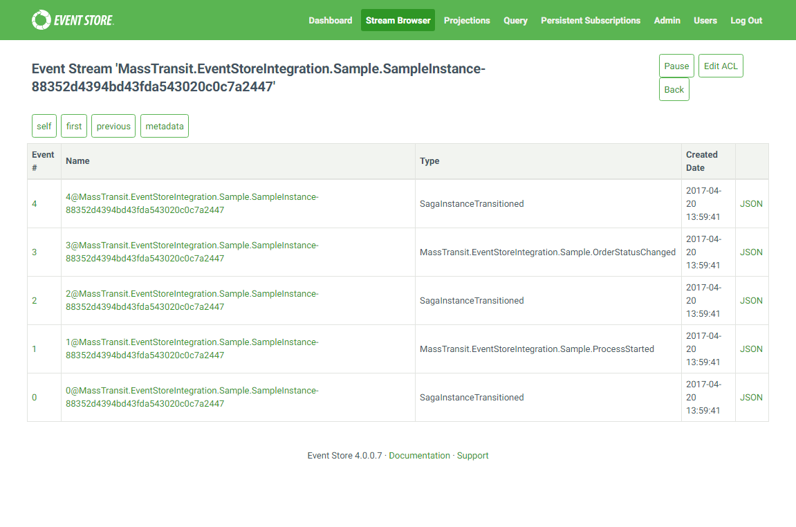

# MassTransit.EventStore
EventStore audit store for MassTransit

[](https://www.nuget.org/packages/MassTransit.EventStore/)
[](https://www.myget.org/)

## Installation

The library is published on nuget.org.

Use `Install-Package MassTransit.EventStore` to install it.

## Usage

This library provides two types of persistence:
 * Audit persistence
 * Event-sourced saga persistence
 
### Audit

To use EventStore as audit store in MassTransit, use the following code:

```csharp
// initialise ES connection
var eventStoreConnection = EventStoreConnection.Create(connectionString);
await eventStoreConnection.ConnectAsync();

// initialise the store
var store = new EventStoreMessageAudit(eventStoreConnection, "audit-stream-name");

// configure the bus
var bus = ....;
bus.ConnectConsumeAuditObserver(store);
bus.ConnectSendAuditObservers(store);

await bus.StartAsync();
```

Hence that `ConnectSendAuditObservers` connects both sending and publishing observers.

### Event-Sourced Saga

You can make your saga instances event-sourced and use EventStore to persist them.
This will allow you to see the full history of your processed, which is great for
tracking and tracing, also gives you a complete audit log for your workflows.

First, you need to make your instances event-sourced. This requires that all state
changes are done as event handlers. Here is an example of such instance class:

```csharp
public class SampleInstance : EventSourcedSagaInstance, SagaStateMachineInstance
{
    public SampleInstance(Guid correlationId) : this()
    {
        CorrelationId = correlationId;
    }

    private SampleInstance()
    {
        Register<ProcessStarted>(x => OrderId = x.OrderId);
        Register<OrderStatusChanged>(x => OrderStatus = x.OrderStatus);
    }

    public string OrderStatus { get; private set; }
    public string OrderId { get; private set; }
}
```

As you can see, at least two things need to be done:
 * Inherit your instance from the `EventSourcedSagaInstance` abstract class
 * Register event handlers for all state changes
 
The base class provides the default `InitialState` property of type `string`, so
you do not need to add it.

Sample state machine, which uses this instance, looks like this:

```csharp
public class SampleStateMachine : MassTransitStateMachine<SampleInstance>
{
    public SampleStateMachine()
    {
        InstanceState(x => x.CurrentState);

        Event(() => Started,
            x => x.CorrelateById(e => e.Message.CorrelationId).SelectId(e => e.Message.CorrelationId));
        Event(() => Stopped, x => x.CorrelateById(e => e.Message.CorrelationId));
        Event(() => StatusChanged, x => x.CorrelateById(e => e.Message.CorrelationId));

        Initially(
            When(Started)
                .Then(c => c.Instance.Apply(c.Data))
                .TransitionTo(Running));

        During(Running,
            When(StatusChanged)
                .Then(c => c.Instance.Apply(c.Data)),
            When(Stopped)
                .TransitionTo(Done)
                .Finalize());
    }

    public State Running { get; private set; }
    public State Done { get; private set; }
    public Event<ProcessStarted> Started { get; private set; }
    public Event<ProcessStopped> Stopped { get; private set; }
    public Event<OrderStatusChanged> StatusChanged { get; private set; }
}
```

You can see that in each `When` we need to call the `ApplyChange` method
to trigger the instance event handler, which changes the instance state.
All changes are then saved as separate events.

The last step is to tell MassTransit to use the EventStore repository:

```csharp
var connection = EventStoreConnection.Create(connectionString);
var repository = new EventStoreSagaRepository<SampleInstance>(connection);

var bus = Bus.Factory.CreateUsingRabbitMq(c =>
    {
        var host = c.Host(new Uri("rabbitmq://localhost"), h =>
        {
            h.Username("guest");
            h.Password("guest");
        });

        var machine = new SampleStateMachine();
        c.ReceiveEndpoint(host, "essaga_test", 
            ep => ep.StateMachineSaga(machine, repository));
    });
```

Working sample is available in this repository, in the `MassTransit.EventStoreIntegration.Sample` project.

The full lifecycle of this saga is then looks like this in the EventStore:



